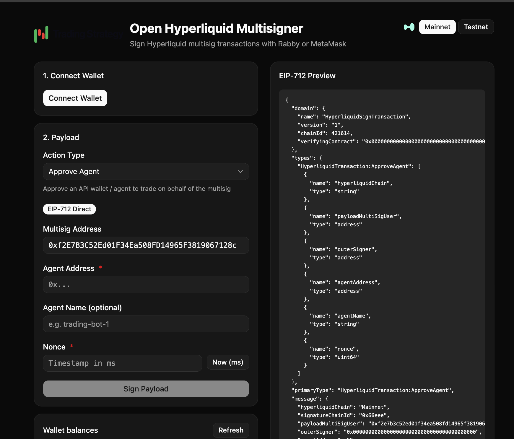

# Open Hyperliquid Multisigner

This application a web user interface for Hyperliquid native multisignature wallets, also known as Hypercore multisig.

# Benefits

- Built for security
- Run locally
- Open source
- Free
- Brutal



👉 [The web version is available on Github hosting](https://tradingstrategy-ai.github.io/open-multisig-hl/)

# Beta warning

- Limited functionality. The software supports only certain actions, but new actions are easy to add.

# Requirements

- Basic understanding of running local JavaScript applications from Git
- `pnpm`

# Run

To locally launch Open Hyperliquid Multisigner:

```shell
pnpm run dev
```

Then go to:

http://localhost:5173/

# Usage

1. One of the multisignature participants creates the value you need to sign
2. They communicate them to others - you can copy-paste the UR:
3. Others connect their wallet and verify values
4. Everyone presses sign

All signers must sign the exact same payload. Coordinate nonce values before signing. Changing any field invalidates previously collected signatures..

# Multisignature and agents

On Hyperliquid, an **agent** (also called an "API wallet") is a secondary signing key that has been delegated authority by a master account to sign a subset of actions on its behalf. Agents exist so that bots, trading software, and automated strategies can place orders and manage positions without exposing the master account's private key.

Delegation happens on-chain via the `ApproveAgent` action:

1. The **master account** (regular wallet or multisig) signs an `ApproveAgent` payload that names an agent address. The master account can also give the agent a human-readable name at approval time.
2. Once approved, the **agent wallet** can sign L1 actions (orders, cancels, vault transfers, sub-account transfers, etc.) on behalf of the master account.
3. Agents **cannot** move user funds off Hyperliquid — actions like `withdraw` and `usdSend` still require a direct signature from the master account (or, in the multisig case, the full set of multisig signers).
4. An agent's signing authority can be revoked at any time by approving a different agent with the same name (which prunes the previous one) or by approving a new unnamed agent (which prunes any existing unnamed agent).

**Why this matters for multisig.** Collecting signatures from every multisig participant for every single order is impractical for active trading. Instead, the multisig collectively signs a single `ApproveAgent` action once, delegating day-to-day trading to an agent wallet. From that point on, the agent can place orders and cancel them unilaterally, while anything that moves funds out of the multisig (withdrawals, transfers) still requires the full multisig quorum.

Open Hyperliquid Multisigner supports both sides of this flow:

- `Approve Agent` — the multisig-coordinated action that authorises an agent wallet
- `Withdraw`, `USD Send`, `Spot Send`, `USD Class Transfer`, `Token Delegate`, `Convert to MultiSig` — the fund-moving actions that always require the full multisig quorum
- L1 actions (`Place Order`, `Cancel Order`, `Vault Transfer`, `Sub-Account Transfer`, etc.) — signable either by the multisig quorum or, once delegation is set up, by the approved agent directly

For the canonical protocol reference, see the Hyperliquid documentation on [nonces and API wallets](https://hyperliquid.gitbook.io/hyperliquid-docs/for-developers/api/nonces-and-api-wallets).

# How to create Hyperliquid native multisignature wallet

TODO

# Architecture

- Built with Svelte and Viem

# Support

- [Join Discord for any questions](https://tradingstrategy.ai/community).

# Social media

- [Watch tutorials on YouTube](https://www.youtube.com/@tradingstrategyprotocol)
- [Follow on Twitter](https://twitter.com/TradingProtocol)
- [Follow on Telegram](https://t.me/trading_protocol)
- [Follow on LinkedIn](https://www.linkedin.com/company/trading-strategy/)

# License

MIT.

[Created by Trading Strategy](https://tradingstrategy.ai).
